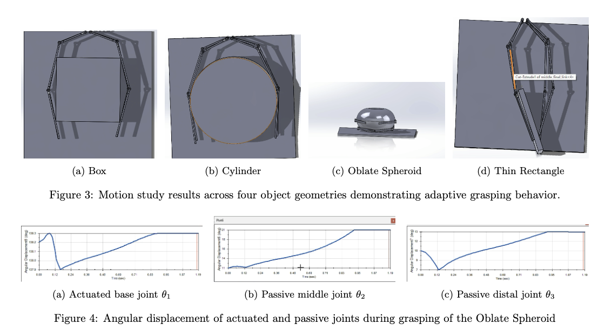

# 1-DOF Underactuated Robotic Hand with Adaptive Grasping via Torsional Springs

**Adrian** — Northeastern University, EECE5554

A four-finger underactuated robotic gripper inspired by the SDM Hand (Dollar & Howe), designed and simulated in SolidWorks. The gripper achieves adaptive grasping across varied object geometries using a single actuator per finger and passive torsional springs.



## How to Run

**Requirements:** SolidWorks with the Motion Analysis add-in enabled.

1. Open `final_assem.SLDASM` in SolidWorks. If prompted to locate missing references, point each part to the corresponding `.SLDPRT` file in the same directory.
2. In the bottom panel, select the **Motion Study** tab.
3. Click **Calculate** (or **Play**) to run the simulation.
4. To test a different object geometry, suppress the current object body in the assembly tree and unsuppress the desired one, then recalculate.

## Overview

Fully actuated robotic hands offer dexterity but are mechanically complex. Simple grippers lack versatility. This design occupies the middle ground: a **1-DOF-per-finger underactuated hand** that uses torsional springs at passive joints to conform to object geometry without additional actuation.

Each finger has **3 DOF** (proximal, middle, distal) but only **1 actuated DOF** — a tendon force applied at the distal link tip directed radially inward. The remaining 2 DOF per finger are governed by torsional springs, giving the full 4-finger hand **12 total DOF with only 4 actuated**.

## Mechanism Design

### Finger Structure

Each finger is a planar serial chain of three rigid links connected by revolute joints:

| Link | Length (mm) | Joint Angle | Type |
|------|-------------|-------------|------|
| Proximal | 100 | θ₁ ∈ [0°, −47°] | Actuated |
| Middle | 180 | θ₂ = 30° | Passive |
| Distal | 194 | θ₃ = 30° | Passive |

The four fingers are arranged symmetrically around a central palm structure.

### Spring Configuration

Torsional springs at each revolute joint bias the fingers toward closure:

- **Proximal & middle joints:** k = 18 N·mm/deg
- **Distal joint:** k = 5 N·mm/deg (greater fingertip compliance)
- **Damping:** C = 15 N·mm/(deg/s), linear type

Springs are wound inward (counter-clockwise on left fingers, clockwise on right), maintaining a non-zero passive joint angle at rest and keeping fingers away from kinematic singularities.

## Mobility & DOF Analysis

Using the planar Grübler formula for a single finger (n = 4 links, j₁ = 3 revolute joints):

```
M_finger = 3(4 − 1) − 2(3) = 3
M_hand   = 4 × 3 = 12  (4 actuated, 8 passive)
```

## Forward Kinematics

End-effector position for a single finger (passive joints fixed at spring-free angle):

```
x = l₁cos(θ₁) + l₂cos(θ₁+θ₂) + l₃cos(θ₁+θ₂+θ₃)
y = l₁sin(θ₁) + l₂sin(θ₁+θ₂) + l₃sin(θ₁+θ₂+θ₃)
```

Sweeping θ₁ across its full ~47° range traces the end-effector workspace. In practice, passive joints rotate freely in response to contact, extending the effective reachable configurations.

## SolidWorks Motion Study

### Simulation Setup

- **Actuation:** 1 N force applied at the distal link tip, directed radially inward (force vector rotates with the finger)
- **Material:** Rubber (dry) on arms and objects to simulate soft finger pads and increase friction
- **Objects tested:** Box, cylinder, oblate spheroid, thin rectangle

### Results

| Object | Outcome |
|--------|---------|
| Box | Stable, uniform contact distribution |
| Cylinder | Best demonstrated adaptive wrapping behavior |
| Oblate Spheroid | Each finger found stable configuration despite curved profile |
| Thin Rectangle | Least uniform — inconsistent closure rate caused object to shift before stabilizing |

Angular displacement plots confirm that the actuated base joint θ₁ shows a transient spike (force overcoming static spring resistance), while passive joints θ₂ and θ₃ demonstrate smooth independent rotation — validating that the torsional springs successfully transmit closure through the kinematic chain.

## CAD Files

All parts modeled in SolidWorks (`.SLDPRT`), assembled in `final_assem.SLDASM`.

| File | Description |
|------|-------------|
| `final_assem.SLDASM` | Main assembly |
| `final_base.SLDPRT` | Palm/base structure |
| `distal_link_final.SLDPRT` | Distal phalanx |
| `middle_final_link.SLDPRT` | Middle phalanx |
| `pin.SLDPRT` | Revolute joint pin |
| `sphere.SLDPRT` | Spherical test object |
| `final_bottle.SLDPRT` | Bottle-shaped passive element |
| `final box.SLDPRT` | Box test object |

## Media

Simulation videos are in the `media/` folder:

| File | Description |
|------|-------------|
| `final_assem.mp4` | Primary assembly demonstration |
| `final_assem_sq.mp4` | Box/square object grasping |
| `final_assem_bigger_cir.mp4` | Larger cylinder grasping |
| `final_assem_oblate.mp4` | Oblate spheroid grasping |
| `sphere_vid.mp4` | Spherical object grasping |

## References

1. A. M. Dollar and R. D. Howe, "The highly adaptive SDM hand: Design and performance evaluation," *IJRR*, vol. 29, no. 5, pp. 585–597, 2010.
2. M. Ciocarlie and P. Allen, "Hand posture subspaces for dexterous robotic grasping," *IJRR*, vol. 28, no. 7, pp. 851–867, 2009.
3. C. Gosselin, F. Pelletier, and T. Laliberte, "An anthropomorphic underactuated robotic hand with 15 dofs and a single actuator," pp. 749–754, 2008.
4. R. R. Ma and A. M. Dollar, "An underactuated hand for efficient finger-gaiting-based dexterous manipulation," *IEEE ROBIO*, 2014, pp. 2214–2219.
